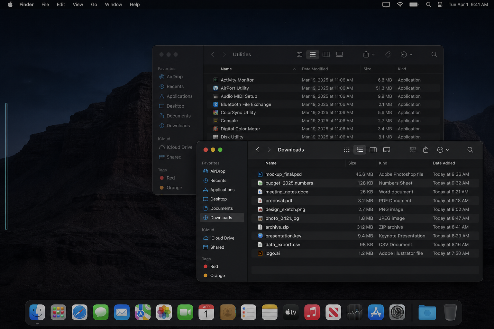
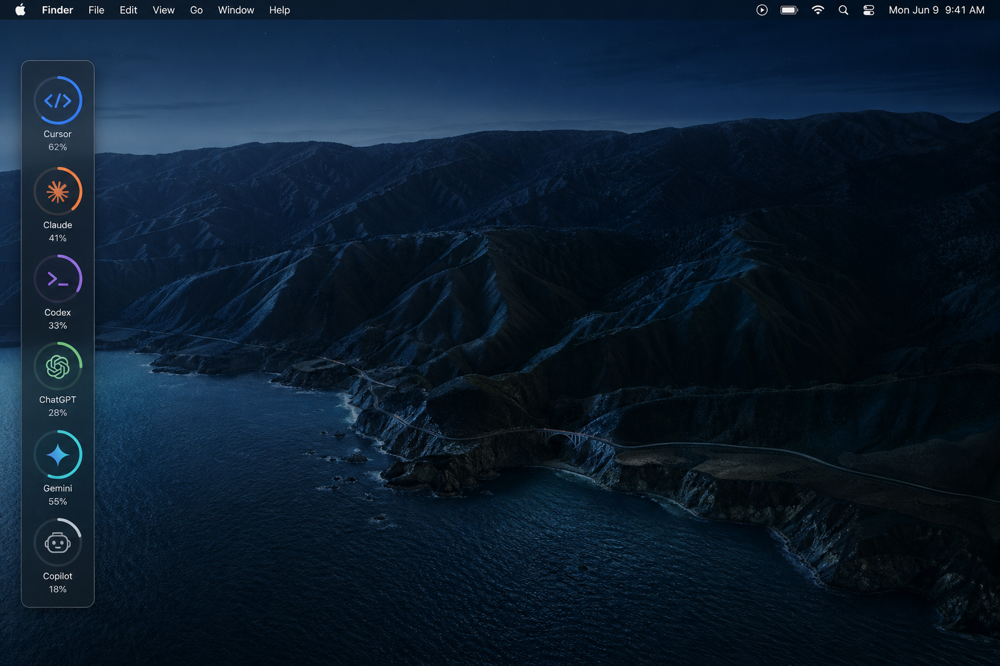
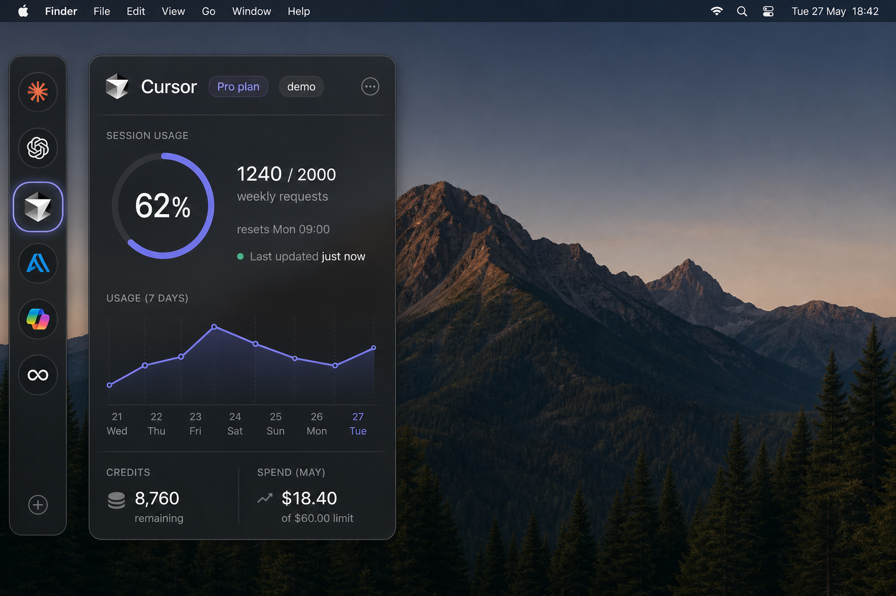

# AIrail — Claude Code build brief

Read this whole file before writing code. The PNGs in `renders/` are the visual source of truth. Match them. Do not invent a menu-bar app.

You are building **AIrail**, a native macOS 14+ utility. Ship as source on GitHub (not the App Store). First runnable cut uses realistic **demo data**. Live provider APIs come later.

Author: Vincent Jacobs (`Vincentj88-python` on GitHub). MIT license.

---

## How to use this folder

1. Put this markdown and the `renders/` folder at the root of a new git repo (or paste this file as the first Claude Code prompt and keep `renders/` next to it).
2. Open the three PNGs. Treat them as design comps, not optional inspiration.
3. Build a real `.app` you can Run from Xcode on a Mac. A Swift package *executable* is not enough; we need an app bundle with `LSUIElement`.

```
airail/
├── AIrail-CLAUDE.md          ← this file
├── renders/
│   ├── 01-collapsed-hairline.png
│   ├── 02-hover-logos.png
│   └── 03-stats-overlay.png
├── AIrail.xcodeproj/         ← you create this
├── Sources/
└── Tests/
```

---

## What AIrail is

A **screen-edge rail** that tracks usage of the AI coding tools the user actually runs.

CodexBar ([steipete/CodexBar](https://github.com/steipete/CodexBar), [codexbar.app](https://codexbar.app)) is a **menu-bar meter farm**. Tiny icons, crowded status items, you still click to learn anything. Do **not** clone CodexBar’s code, parsers, menu-bar UX, or assets.

AIrail competes on UX:

| CodexBar | AIrail |
| --- | --- |
| Menu bar status items | Left (or right) screen-edge rail |
| Click a tiny icon | Hover to expand, click for a HUD overlay |
| One provider at a time unless “merge icons” | All enabled tools visible as a vertical stack of logos |
| Dense inspector menus | One glass overlay: session, weekly, reset, sparkline |

### Three states (must match the renders)

**1. Collapsed (default, idle)**



- 4–6 pt vertical hairline hugging the **left** screen edge (setting: left or right).
- Vertically centered, ~70% of screen height, rounded caps.
- Frosted dark glass, faint teal/blue glow.
- Visible on all Spaces. **No Dock icon** (`LSUIElement` / accessory activation policy).
- Does **not** steal key focus on hover.
- Easy to miss on purpose. That is the point.

**2. Hover (expanded rail)**



- On hover, spring-expand to ~56–64 pt wide.
- Vertical stack of circular marks with **usage rings**.
- **v1 hover is logo + ring only.** The render shows names and percents under each logo; that is too tall/fat for a real rail. Keep names/percents for the overlay. If you must label, use a tiny tooltip on linger, not stacked captions.
- Collapse after mouse leave + `autoHideDelay` (default 0.3s), unless the overlay is open.

**3. Click (stats overlay)**



- Click a logo (or the rail) to open a **non-fullscreen HUD** next to the rail, not a system modal dialog and not a full-screen sheet.
- Frosted glass, large corner radius, soft shadow. Native macOS HUD, SF Pro.
- Selected logo on the rail gets a subtle glow/highlight.
- Dismiss: Escape, click the same logo again, or click outside.

Overlay content for the selected provider (this layout is the bar):

- Header: mark + name, plan pill (`Pro`), status pill (`demo` / `live` / `stale` / `error`).
- Big circular **session %** ring.
- Weekly `used / limit` (e.g. `1240 / 2000 weekly requests`).
- Reset countdown (`resets Mon 09:00`).
- Last updated (`just now`).
- 7-day sparkline.
- Footer row: credits remaining, spend vs cap when the provider exposes them.

Do **not** ship the render’s `+` add-tool button or random extra logos (Perplexity, infinity) in v1. Stick to the six providers below.

---

## Visual system (lock this in)

- Dark-first, also works in light appearance.
- Materials: `NSVisualEffectView` / SwiftUI `.ultraThinMaterial` over a dark translucent panel.
- Type: SF Pro. Numbers slightly tabular.
- Motion: spring expand/collapse. Honor Reduce Motion (crossfade, no spring).
- Usage ring stroke ~2.5–3 pt, track at ~20% opacity, fill in the provider color.
- Rail does not look like a window: no traffic lights, no title bar, not in Mission Control as a normal window if you can avoid it (`NSWindow.CollectionBehavior` canJoinAllSpaces, fullScreenAuxiliary, stationary as appropriate).
- Overlay can become key. Rail cannot.

### Provider marks (original, not stolen brand assets)

Do not copy CodexBar SVGs or official brand logos as shipped files. Use SF Symbols + a letter/monogram in a colored circle:

| id | Name | Color | Symbol (starting point) |
| --- | --- | --- | --- |
| `cursor` | Cursor | blue `#3B82F6` | `chevron.left.forwardslash.chevron.right` |
| `claude` | Claude | orange `#F97316` | `sparkles` |
| `codex` | Codex | purple `#A855F7` | `terminal` |
| `chatgpt` | ChatGPT | green `#22C55E` | `bubble.left.and.bubble.right` |
| `gemini` | Gemini | teal `#14B8A6` | `sparkle` |
| `copilot` | Copilot | gray `#9CA3AF` | `cpu` |

---

## Product requirements

### Always-on chrome

- macOS 14+, Swift 6, SwiftUI + AppKit.
- `LSUIElement` = true. `NSApp.setActivationPolicy(.accessory)`.
- Default edge: **left**. Settings toggle left/right. Rebuild/reposition the panel when that changes.
- Height: ~70% of the visible frame of the screen that contains the mouse (or the primary screen if simpler). Centered vertically. Inset a few points from the absolute edge so the glow is visible.
- All Spaces + full-screen auxiliary so it still shows over full-screen Xcode.

### Interaction

- Hover expands. Click logo opens overlay for that provider. Clicking another logo swaps the overlay content without closing.
- Overlay Escape / outside click / same-logo toggle closes it.
- Settings: native Settings scene (`Cmd+,`). Include:
  - Rail side
  - Auto-hide delay
  - Refresh interval (default 60s)
  - Enabled providers (toggles)
  - Launch at login (use `SMAppService` if entitlements allow; otherwise a clear “not wired yet” note in Settings, do not fake it)
- No onboarding wizard in v1. First launch just shows the rail with demo data.

### Data

Define:

```swift
struct UsageSnapshot: Identifiable, Sendable {
    var id: String { providerId }
    let providerId: String
    let displayName: String
    let sessionUsed: Double?
    let sessionLimit: Double?
    let sessionPercent: Double?   // 0...100
    let weeklyUsed: Double?
    let weeklyLimit: Double?
    let weeklyPercent: Double?
    let resetsAt: Date?
    let credits: Double?
    let spend: Double?
    let spendCap: Double?
    let plan: String?
    let status: UsageStatus      // ok, demo, stale, error, outage
    let lastUpdated: Date
    let weeklyHistory: [Double]  // 7 points, oldest first
}

protocol UsageProviding: AnyObject {
    var id: String { get }
    var displayName: String { get }
    var color: Color { get }
    var symbolName: String { get }
    func isInstalled() -> Bool
    func fetchUsage() async -> UsageSnapshot
}
```

**v1 data policy (important):**

- Ship a high-quality **mock** that looks alive (slow random walk around a base %, not a new random jumble every refresh).
- Best-effort **install detection** only:
  - Cursor: `~/.cursor` or `~/Library/Application Support/Cursor`
  - Claude: `~/.claude` or `~/Library/Application Support/Claude`
  - Codex: `~/.codex`
  - ChatGPT / OpenAI: optional `~/.openai` or Codex home
  - Gemini: `~/.gemini` or `gcloud` on PATH
  - Copilot: `gh` on PATH or `~/Library/Application Support/GitHub Copilot`
- If installed, you may set status `.ok` only when you have a **real** local read. Otherwise keep `.demo` even if the app is installed. Never pretend live numbers.
- Do **not** scrape browser cookies, Keychain, or CodexBar parsers in v1.
- No telemetry. No network calls except optional future provider APIs. Secrets never leave the machine.
- Refresh on a timer. Pause when the Mac is asleep (timer in `.common` run loop is fine).

`ProviderManager` owns the list, enabled filter, snapshots, and refresh.

---

## Architecture (suggested, not sacred)

Keep it small. Something like:

```
Sources/AIrail/
  AIrailApp.swift              @main, Settings scene
  AppDelegate.swift            wires windows, accessory policy
  Models/UsageSnapshot.swift
  Models/AppSettings.swift     UserDefaults, ObservableObject
  Providers/UsageProviding.swift
  Providers/ProviderManager.swift
  Providers/MockSupport.swift  shared random-walk helper
  Providers/CursorProvider.swift
  Providers/ClaudeProvider.swift
  Providers/CodexProvider.swift
  Providers/ChatGPTProvider.swift
  Providers/GeminiProvider.swift
  Providers/CopilotProvider.swift
  Windows/RailWindow.swift     NSPanel, tracking area, edge math
  Windows/OverlayWindow.swift  NSPanel HUD
  Views/RailView.swift
  Views/LogoMark.swift         circle + ring + symbol
  Views/OverlayView.swift
  Views/Sparkline.swift
  Views/SettingsView.swift
  Resources/Info.plist
```

Windowing notes (you must get this right; it is the whole product):

- Use `NSPanel` for the rail: `borderless`, `nonactivating`, `floating` or `statusBar` level, opaque = false, background clear, `ignoresMouseEvents` = false, `collectionBehavior` includes `canJoinAllSpaces`, `fullScreenAuxiliary`, `ignoresCycle`.
- Tracking area for hover. Expand width by changing `setFrame(_:display:animate:)` or SwiftUI animation inside a slightly larger hit target. Collapsed hit target should be at least ~8–10 pt wide so it is actually hoverable.
- Overlay: separate `NSPanel`, positioned adjacent to the rail (to the right if rail is left; to the left if rail is right). Keep on-screen (don’t clip off the right edge of a small display).
- Do not use a normal `WindowGroup` for the rail (it will show a title-bar window and a Dock icon unless you fight it).

Concurrency: Swift 6. `ProviderManager` on `@MainActor`. Fetches `async`. No data races.

---

## Xcode project (required)

Create a real macOS App target, not just `swift run`:

- Bundle id: `lol.tugwar.airail` is fine, or `com.vincentjacobs.airail` if you prefer.
- Deployment: macOS 14.
- `INFOPLIST_KEY_LSUIElement = YES` (and Info.plist).
- SwiftUI lifecycle + AppKit delegate adaptor.
- Unit tests: snapshot percent clamp, weekly percent math, provider registry ids unique, mock history length 7.
- `.gitignore` for Xcode, DerivedData, `.DS_Store`.
- `README.md`: what it is, screenshot of the three states (you may copy the renders), how to open the xcodeproj and Run, GitHub-not-App-Store, comparison table vs CodexBar, MIT.
- `LICENSE` MIT, copyright 2026 Vincent Jacobs.

Do **not** drown the repo in 11 extra markdown files (FAQ, ROADMAP, SECURITY, PROJECT_SUMMARY…). README + this brief is enough.

---

## Out of scope for v1 (do not do these now)

- App Store, notarization, Sparkle, Homebrew cask.
- WidgetKit, CLI binary, Linux.
- Cookie scraping, Keychain OAuth, PTY to Claude/Codex CLIs.
- 29 CodexBar providers. Only the six above.
- Team features, accounts, cloud sync.
- Cloning or vendoring CodexBar source.

---

## Acceptance checklist

Claude Code: do not stop until you can honestly tick these.

- [ ] `AIrail.xcodeproj` (or an Xcode-generated project in the repo) builds a `.app` for macOS 14.
- [ ] App has no Dock icon. Hairline appears on the left edge at launch.
- [ ] Hover expands to six logo+ring marks (only enabled providers).
- [ ] Click opens a glass HUD that matches `renders/03-stats-overlay.png` in density and hierarchy (header, ring, weekly, reset, sparkline, footer).
- [ ] Overlay shows a `demo` badge on mock data.
- [ ] Settings exist (`Cmd+,`): side, delay, interval, provider toggles.
- [ ] Reduce Motion does not spring.
- [ ] Dark and light both usable.
- [ ] VoiceOver labels on each logo and on overlay numbers.
- [ ] Tests for snapshot math + registry.
- [ ] README + MIT + gitignore.
- [ ] No CodexBar source, no stolen logo files, no telemetry.

When you are done, print: how to open in Xcode, bundle id, and any entitlements you added.

---

## First message to yourself (if this file is the prompt)

Build AIrail from this spec. Look at `renders/01-collapsed-hairline.png`, `renders/02-hover-logos.png`, and `renders/03-stats-overlay.png` first. Then create the Xcode macOS app target and implement the rail, hover, overlay, six demo providers, and settings. Keep the repo small and polished.
