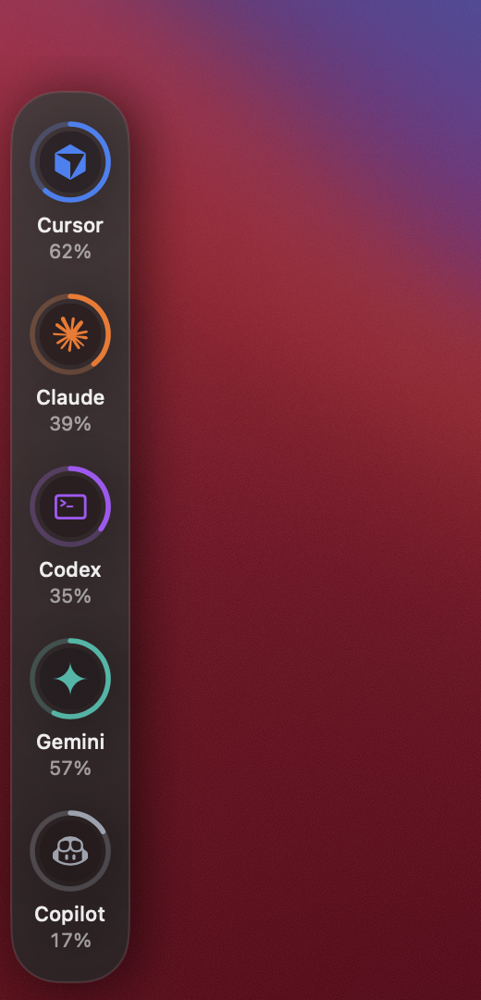
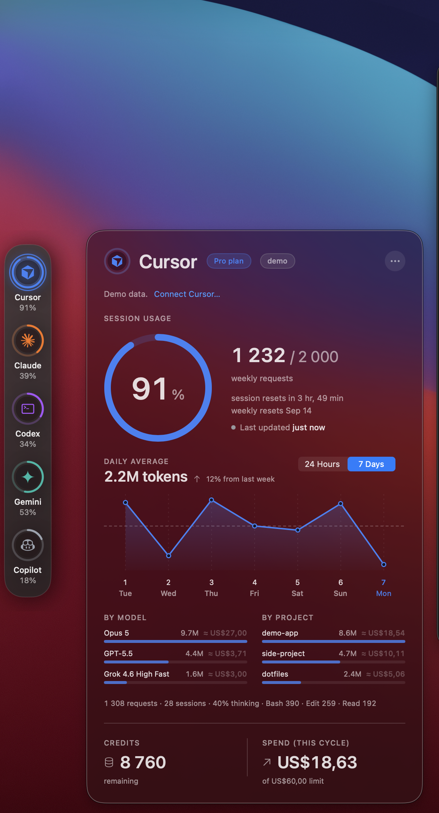

# AIrail

A screen-edge rail for macOS that tracks usage of the AI coding tools you actually run.

No menu-bar clutter. A barely-there hairline hugs the edge of your screen and fills along its length as your nearest limit fills; hover to expand it into a stack of provider marks with usage rings; click one for a glass card with the session ring, the week, reset times, pace, and a Screen Time-style chart.

| Collapsed | Hover |
| --- | --- |
|  |  |

| The card | Top |
| --- | --- |
|  |  |

*Shot from a build by `scripts/screenshots.sh` on demo data, which is why every capture wears the `demo` badge.*

## Why the edge

There are plenty of menu-bar meters for these tools, and the best of them ([CodexBar](https://github.com/steipete/CodexBar)) covers far more providers than AIrail ever will. AIrail is a different bet: a meter you never open.

**It lives where your eye already rests.** A hairline on the edge of the display, or under the notch, is in your peripheral vision all day. The menu bar is where you go to look for something; the edge is where you notice something.

**The line itself is the reading.** It warms from a calm periwinkle to amber and then red as your nearest limit fills, and it fills along its length with that limit. You know you are at 80% of a session without a click, a glance at a number, or a notification.

**One card, in Apple's own idiom.** Click a mark and the card reads like System Settings › Battery and Screen Time: a ring with the time elapsed in the window inside it, reset times that tick, the daily average against last week, cost beside each model and project, and a line that tells you when the figure moved while this Mac did nothing.

**Honest by construction.** `live` only ever means a real read succeeded. Stale numbers expire at their own reset instead of lingering. Every estimate says *est.* Demo data wears a `demo` badge. Nothing is ever guessed to fill a gap.

**Read-only, and provable.** AIrail borrows the sign-ins your tools already keep and never writes anything back. It talks to seven hosts, allowlisted in code, keeps no cache or cookie jar, and Settings › Privacy lists every host it has contacted since launch, what it keeps on disk, and what this build is signed with.

## Accounts

AIrail never asks for a password and has no sign-in of its own. Every tool it tracks is already signed in on your Mac, so **Settings › Accounts** simply lets you connect the ones you use — AIrail borrows that tool's existing sign-in, read-only, and asks the tool's own service for your plan's usage. Add and remove accounts with the `+`/`−` buttons, the way Internet Accounts or Xcode's Accounts pane work; each account page explains exactly what is read and where it goes.

| Account | What AIrail uses | What you get |
| --- | --- | --- |
| **Claude** | The sign-in Claude Code keeps in your Keychain (macOS asks you first) + your local transcripts in `~/.claude` | Real 5-hour and weekly limits from Anthropic, reset times, 24-hour and 7-day charts, usage by model and by project, thinking share, tool counts |
| **Codex** *(covers ChatGPT)* | The sign-in Codex keeps in `~/.codex` + your local Codex sessions | Real 5-hour and weekly limits from OpenAI, reset times, 24-hour and 7-day charts, usage by model and by project, reasoning share, tool counts |
| **Copilot** | Your GitHub CLI (`gh`) sign-in, or the Copilot editor extension's | AI credits (or premium requests on a legacy plan), chat and completion meters for the month, plan, reset date |
| **Cursor** | The sign-in Cursor stores in its local database | Included usage, Cursor-models and Other-models meters for the billing cycle, plan, cycle end, and the per-request feed behind the charts and usage by model |
| **Gemini** | — | Coming soon: no dependable way to read its quota yet |
| **Other…** | An API key you paste, kept in AIrail's own Keychain item | OpenRouter (credits used / remaining), DeepSeek (balance), Anthropic API and OpenAI API (organization usage by model and month-to-date cost, with an Admin key) |

ChatGPT and Codex share one OpenAI account, and ChatGPT itself doesn't publish usage limits, so the Codex account stands in for both. Cursor has no public API — AIrail reads what its dashboard reads, which a Cursor update could break; if that happens you get a `stale` or `error` badge, never a guess.

*Other…* is Internet Accounts' "Add Other Account": platforms with a **documented** usage or credits API, connected by key. Consumer web apps without one (Perplexity, Grok, Claude.ai, ChatGPT on the web, Le Chat, Kimi) are listed there as unsupported with a link to request a provider — AIrail doesn't scrape browser cookies to fake it.

Rules AIrail holds itself to: it only ever *reads* a tool's sign-in, never uses a refresh token or writes anything back, keeps no tokens on disk (one ephemeral session, no cache, no cookie jar), and the only network traffic is each connected tool's own usage check plus a daily look at GitHub for a newer release — seven hosts, allowlisted in code, and nothing else can be reached. If a sign-in expires, the last real numbers stay on screen marked `stale` with a note to open the tool. What it does keep on disk is a small usage ledger per account under `~/Library/Application Support/AIrail` — daily totals for up to a year, model ids, project folder names, the last real numbers and the pace samples — so charts and pace survive a relaunch, and Copilot (which has no per-request feed) gets a day-by-day chart from the levels AIrail sampled. Never a token, a key or an email, and it is deleted when you remove the account.

## Providers

Cursor, Claude, Codex, Gemini, Copilot — real brand marks rendered from vector path data ([Simple Icons](https://simpleicons.org), CC0-1.0), tinted in the rail's provider colors. No binary logo assets are shipped; the marks live as path data in `Sources/AIrail/Views/BrandIcons.swift` and are drawn by a small built-in SVG path renderer. All trademarks belong to their respective owners and are used solely to identify the services being monitored. Codex keeps a terminal glyph (`>_`), which is its actual CLI mark.

The rail shows your connected accounts (each has a *Show on rail* switch) and sizes itself to fit.

## Top

**Settings › Rail › Position › Top** folds the rail into the top of the display, Dynamic Island-style. On a MacBook with a notch: idle, a hairline sits under the notch; hover, and the notch grows down into a black island (OLED black, so it merges with the physical cut-out) holding the marks and rings; click, and the HUD hangs beneath it. It uses the notch geometry macOS reports (`safeAreaInsets`) and works over full-screen apps.

On a display without a notch, Top is the same gesture with nothing drawn until you ask for it: idle, only the hairline shows, just under the centre of the menu bar (nothing floats over the bar or over full-screen video); hover it, and an island in the app's frosted dark glass grows down with the marks. Pick the display first, then the position — with Automatic, Top uses the notch when a notched display is attached and the menu-bar display otherwise. Point at a mark and its name and percent reveal in a caption line beneath, the way the Dynamic Island shows detail.

## The card

Click a mark for its glass HUD. Top to bottom: the session ring (or the billing-cycle/monthly ring for tools without sessions) with reset times; the provider's meters when it has several; a chart with a `24 Hours | 7 Days` switch in the style of System Settings › Battery, headed the way Screen Time does it (the last 24 hours' total, or the daily average and how it compares with the week before) — hover any bar or day for its tokens, requests and input/output/cache split, and for Claude and Codex the current 5-hour session window is shaded so you can see where you are in it; *by model* and *by project* lists (Screen Time-style share bars); and one line of activity — requests, sessions, thinking share, top tools. Everything below the ring comes from local transcripts or the tool's own per-request feed, never estimates.

The collapsed hairline is a subtle line in a single calm accent that gently breathes, with a soft matching glow (static under Reduce Motion) — barely there on purpose.

## Insights

- **Time to limit.** While a session is actively climbing, the HUD projects when you'll hit the limit at that pace ("≈ 2h 40m to limit"), or reassures you the window resets first.
- **Notifications.** Opt-in macOS alerts when an account passes 75% or 90%, and one at the moment that window resets so you can batch heavy work; click any of them to open that account's HUD (Settings › General — macOS asks for permission when you turn it on).
- **Ambient warning.** The collapsed hairline stays a calm accent with headroom and warms to amber then red as your nearest limit fills — peripheral awareness without opening anything.
- **API-equivalent value.** For subscription accounts, an estimate of what the week's tokens would have cost pay-as-you-go ("≈ $340 of API-priced tokens this week"), from public model prices — an estimate, never a bill.

## Demo data

Until you connect an account, the rail shows demo data for the tools it detects on your Mac (a slow random walk that looks alive but is not real), every mark carries a `demo` badge, and the overlay offers a **Connect…** link. `live` only ever means a real read succeeded.

No telemetry. Nothing scraped from browsers or cookies. AIrail reads only the sign-ins of the tools you connect, after you approve each one.

## Install

Download `AIrail-x.y.z.dmg` from the [latest release](https://github.com/Vincentj88-python/AIrail/releases), open it, and drag **AIrail** into **Applications**.

Because AIrail reads the sign-ins of the tools you connect, it isn't sandboxed and so isn't on the App Store. Until it's notarized with an Apple Developer ID, macOS will block the first launch — this is expected:

1. Open **AIrail** from Applications. macOS says it can't check it for malware.
2. Go to **System Settings › Privacy & Security**, scroll down, and click **Open Anyway** (on macOS 15 and later the old right-click › Open trick no longer works).
3. You only do this once. After that it launches normally, and updates keep it that way.

Once the repository is public there will also be a Homebrew tap: `brew install --cask vincentj88/airail/airail`. Notarized builds — no warning at all — follow as soon as there is a Developer ID; a GitHub Sponsors goal covers exactly that.

The app has no Dock icon — look for the faint hairline on the edge of your screen (or the notch/island, depending on your settings).

## Build from source

Requires **macOS 14+** and **Xcode 16+** (Swift 6).

```
git clone https://github.com/Vincentj88-python/AIrail.git
cd AIrail
open AIrail.xcodeproj
```

Select the **AIrail** scheme and **Run** (⌘R). To build a signed DMG the way releases are packaged, run `./scripts/release.sh` (output in `dist/`).

## Using it

- **Hover** the hairline to expand the rail.
- **Click** a logo to open the stats HUD; click another logo to swap, press **Escape** or click outside to dismiss.
- **Right-click** the rail (or use the `…` menu in the HUD) for **Settings…** (⌘,) and **Quit**.

Settings cover accounts (add, remove, show on rail), the rail's display and position — pick a display, then Left, Right, or (for the MacBook's built-in display) Notch; Automatic picks the outer edge of your whole desktop so the pointer rests on the hairline instead of sliding onto the next monitor, and the pane warns when a chosen edge is a seam — plus auto-hide delay, refresh interval, and launch at login.

Launch flags for development: `--settings[=accounts]` opens Settings, `--add-account[=other]` opens the Add Account sheet (or its API-key page), `--overlay=<id>` opens the card for a provider, `--expanded` opens the rail as if hovered, and `--demo=<percent>` raises the busiest demo account to that figure. `scripts/screenshots.sh` uses the last three, with `-connectedAccounts '()' -railPosition top|left` on the command line (the defaults argument domain, so nothing persists) to shoot the README captures from demo data.

AIrail is distributed as a signed DMG and source on GitHub, not through the App Store.

## Releasing & updates

AIrail checks for updates itself: **right-click the rail → Check for Updates…** (also in the HUD's ⋯ menu) asks GitHub for the latest release and shows the notes with a Download button. In the background it asks once a day — an hourly timer, one anonymous request to `api.github.com` (the same allowlisted session as the usage checks, nothing about you in it). A newer release gets one macOS notification with a Download button, and the menu item reads **Update to x.y.z…** until you have it; the background check never puts a window over your work. This starts working once the repo is public; while it's private the check just reports "up to date."

To publish a new version:

```
# check ModelPricing.table against the vendors' price pages (the API-value
# estimate ships as a table, nothing is fetched), bump MARKETING_VERSION in
# the app target, commit, then:
git tag v0.3.0 && git push origin v0.3.0
./scripts/release.sh                       # builds dist/AIrail-0.3.0.dmg
gh release create v0.3.0 dist/AIrail-0.3.0.dmg --title "v0.3.0" --notes-file CHANGELOG.md
```

`release.sh` signs the app with the hardened runtime, a secure timestamp and no entitlements (so no `get-task-allow`), and refuses to package it if any of the three is missing. The same script runs on GitHub's macOS runners from `.github/workflows/release.yml`; its build-provenance attestation (`gh attestation verify`) starts working once the repo is public.

Users then see the update on their next check and download the new DMG. (Seamless one-click, in-place updates — no re-download — come with [Sparkle](https://sparkle-project.org) once the app is notarized and public; the checker is the interim.)

## Tests

Unit tests cover the snapshot math, the accounts model, every provider's parser (against fixtures of the real response shapes), the incremental transcript scanner, and the demo-data engine:

```
xcodebuild -scheme AIrail test
```

Opt-in smoke tests read the accounts actually signed in on your Mac (they hit real endpoints); keyed platforms join in when their key is in the environment:

```
TEST_RUNNER_AIRAIL_LIVE=1 TEST_RUNNER_AIRAIL_OPENROUTER_KEY=sk-or-… \
  xcodebuild -scheme AIrail test -only-testing:AIrailTests/LiveProviderTests
```

## License

MIT © 2026 Vincent Jacobs. See [LICENSE](LICENSE).
